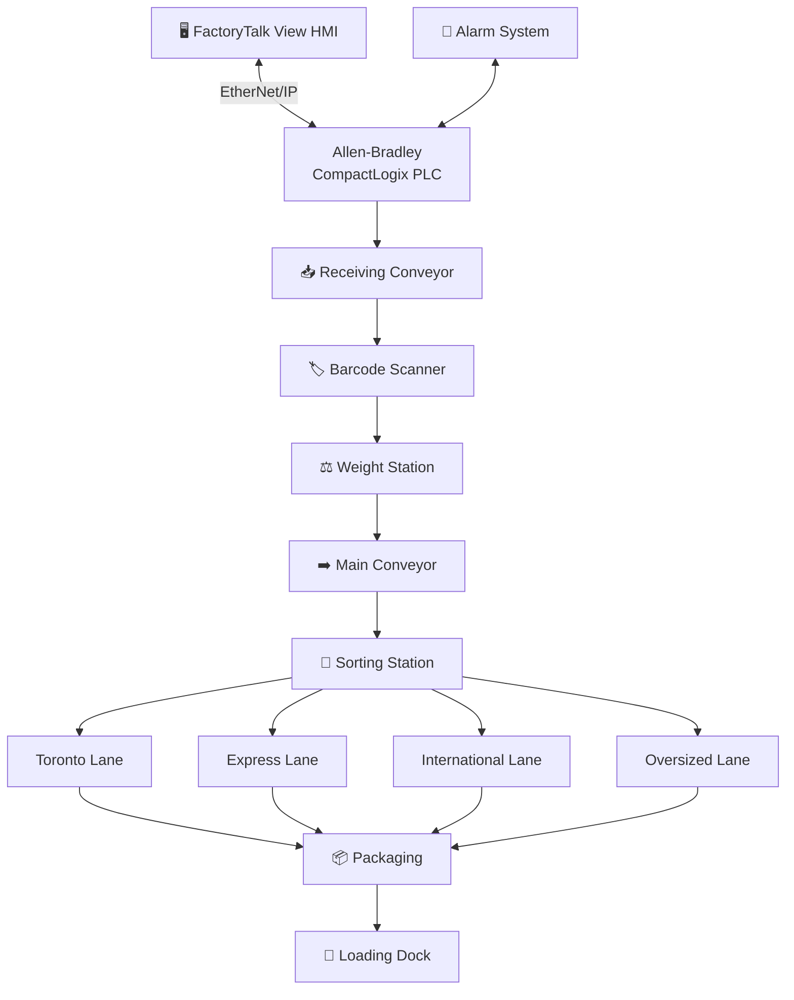

<!-- HERO IMAGE: replace with a wide FactoryTalk View HMI screenshot of the full warehouse system -->

  

<h1 align="center">Industrial Warehouse Package Sorting Automation System</h1>

  Allen-Bradley CompactLogix PLC control system that automates warehouse package handling from receiving through barcode identification, weight inspection, destination sorting, packaging, and shipment, with full FactoryTalk View HMI supervision.

  
  
  
  
  
  
  
  

---

## ▶️ Demo

<!-- Replace with an embedded GIF or a linked MP4/YouTube walkthrough. GIFs autoplay inline on GitHub. -->

  

---

## 📌 Project Overview

An industrial control system that automates the full warehouse package-handling process, moving product from receiving through inspection, sorting, packaging, and shipment under PLC-based sequential control.

Packages enter on a receiving conveyor, are identified by a barcode scanner, and are checked at a weight station before the main conveyor indexes them to a sorting station that diverts each one to its destination lane. Conveyor coordination and interlocking keep product moving without collisions, weight inspection rejects oversized or out-of-tolerance packages, and destination routing directs each package to the correct lane.

The system is supervised end-to-end from a FactoryTalk View HMI, with live status, destination lane screens, package counts, and an alarm summary giving the operator complete visibility and control of the line.

### 🎯 Control Objectives

- Automatically detect packages entering the line.
- Identify each package destination from its barcode.
- Inspect package weight and reject oversized or out-of-tolerance packages.
- Coordinate and interlock the conveyors to prevent collisions and jams.
- Route each package to its correct destination lane.
- Count packages per lane and in total for throughput tracking.
- Monitor faults and annunciate alarms on the HMI.
- Provide emergency-stop and manual-mode operation for safety and maintenance.
- Run continuously with no operator intervention under normal conditions.

---

## ⭐ Project Highlights

| Feature | Value |
|---------|-------|
| **Process** | Warehouse Package Sorting |
| **PLC** | Allen-Bradley CompactLogix |
| **HMI** | FactoryTalk View |
| **Communication** | EtherNet/IP |
| **Control Type** | Sequential Material Handling |
| **Destination Lanes** | Toronto, Express, International, Oversized |
| **Testing** | Commissioned and Tested on Allen-Bradley Hardware |

---

## ✨ Features

- ✔ Automatic Package Detection
- ✔ Barcode Identification
- ✔ Weight Inspection
- ✔ Oversized Package Rejection
- ✔ Destination Sorting (Four Lanes)
- ✔ Conveyor Interlocking
- ✔ Package Counting
- ✔ Alarm Handling
- ✔ Emergency Stop
- ✔ Manual Mode
- ✔ FactoryTalk View HMI Supervision

---

## 🏗️ System Architecture

Packages flow from receiving through identification and inspection to a sorting station that diverts each one to its destination lane, then to packaging and the loading dock. The HMI and alarm system communicate with the PLC over EtherNet/IP for supervision and annunciation.

---

## 🖼️ Project Gallery

<!-- Drop screenshots into /Images and they render as a grid. -->
| Main Overview HMI | Manual Control Screen | Alarm Screen |
|:---:|:---:|:---:|
|  |  |  |
| **Toronto Lane** | **Express Lane** | **International Lane** |
|  |  |  |
| **Oversized Lane** | | |
|  | | |

---

## 📹 System Demonstrations

### Alarm Activation

<!-- 🎥 link or embed Videos/AlarmActivation.mp4 -->
[▶ AlarmActivation.mp4](Videos/AlarmActivation.mp4)

Triggers a fault condition and shows the alarm latching, annunciating on the FactoryTalk View alarm summary, and clearing on operator acknowledgement.

---

### Destination Selection

<!-- 🎥 link or embed Videos/DestinationSelection.mp4 -->
[▶ DestinationSelection.mp4](Videos/DestinationSelection.mp4)

Reads a package barcode and shows the PLC routing it to the selected lane, energizing the correct divert and updating the lane screen and package count.

---

## ⚙️ PLC Logic

### Package Detection

<!-- 📷 replace with ladder screenshot of the detection routine -->

A photo-eye at the receiving conveyor sets a package-present bit that triggers the sort sequence for that unit. Detection is sensor-driven rather than time-based so the line only indexes when a real package is present, eliminating empty cycles and keeping tracking aligned with actual product on the belt.

---

### Destination Sorting

<!-- 📷 replace with ladder screenshot of the sorting routine -->

The barcode scanner reads each package destination code, and a data comparison matches it to one of the four lanes, energizing the corresponding divert output as the package reaches the sorting station. A comparison-based routing table was chosen over hard-wired logic so destinations can be reconfigured without rewiring, and so lanes can be added or reassigned in software.

---

### Weight Inspection

<!-- 📷 replace with ladder screenshot of the weight routine -->

A load cell provides an analog weight value that is scaled and checked against minimum and maximum limits. Packages outside tolerance are flagged and diverted to the Oversized lane. Analog limit comparison was chosen so the acceptance band can be tuned from the HMI without a program change, adapting to different product mixes.

---

### Conveyor Interlocking

<!-- 📷 replace with ladder screenshot of the interlock routine -->

Each conveyor and divert is gated by a downstream-ready permissive, so a package is never released onto a stopped or full lane. Interlocking was chosen to protect equipment and product: it prevents collisions and jams at merge and divert points, which are the highest-risk locations on any sorting line.

---

### Alarm Handling

<!-- 📷 replace with ladder screenshot of the alarm routine -->

Jam, scanner-fault, overweight, lane-full, and emergency-stop conditions each set a latched alarm bit surfaced to the FactoryTalk View alarm summary. Alarms are latched and require operator acknowledgement so a transient fault is never missed, and each alarm identifies the affected station for fast diagnosis.

---

### Emergency Stop

<!-- 📷 replace with ladder screenshot of the E-Stop routine -->

The emergency stop drops a master run permissive that is evaluated ahead of all sequencing logic, de-energizing every conveyor and divert regardless of operating mode. Evaluating the E-Stop first in the scan makes the stop fail-safe: nothing downstream can hold an output once the permissive is removed.

---

### Package Counter

<!-- 📷 replace with ladder screenshot of the counter routine -->

Count-up counters increment per lane and in total as packages are diverted, feeding the throughput displays on the HMI. Per-lane counting was chosen so operators can track production by destination and quickly spot an imbalance that may indicate a scanner or divert problem.

---

### Manual Control

<!-- 📷 replace with ladder screenshot of the manual routine -->

Manual mode lets an operator jog individual conveyors and diverts from the HMI to clear jams and commission the line, while the emergency-stop circuit stays active. A dedicated manual mode was chosen so maintenance can move equipment safely without bypassing the interlocks or the E-Stop.

---

### Full PLC Logic Walkthrough

<!-- 🎥 link or embed Videos/LogicWalkthrough.mp4 -->
[▶ LogicWalkthrough.mp4](Videos/LogicWalkthrough.mp4)

A complete rung-by-rung walkthrough of the program, following a package from detection and barcode read through weight inspection, destination routing, interlocking, and counting, with the alarm handling and emergency-stop response demonstrated live on the HMI.

---

## 🧠 Engineering Challenges

- **<ins>Preventing package collisions</ins>**: sequencing detection, indexing, and diverts so two packages never meet at a merge or divert point.
- **<ins>Coordinating multiple conveyors</ins>**: interlocking receiving, main, and lane conveyors so product only moves when the next stage is ready.
- **<ins>Ensuring destination accuracy</ins>**: tracking each package from barcode read to divert so it reaches the correct lane every time.
- **<ins>Handling oversized packages</ins>**: catching out-of-tolerance weight and routing rejects cleanly without stalling the line.
- **<ins>Maintaining continuous throughput</ins>**: keeping the line indexing steadily under normal conditions with no operator intervention.
- **<ins>Designing scalable ladder logic</ins>**: structuring the routing and interlocks so lanes can be added or reassigned in software.
- **<ins>Preventing false alarms</ins>**: qualifying fault conditions so transient sensor states do not nuisance-trip the alarm summary.

---

## ✅ Testing & Validation

| Function | Status |
|----------|:------:|
| Package Detection | ✅ Verified |
| Barcode Reading | ✅ Verified |
| Weight Inspection | ✅ Verified |
| Destination Routing | ✅ Verified |
| Oversized Detection | ✅ Verified |
| Package Counter | ✅ Verified |
| Alarm Handling | ✅ Verified |
| Emergency Stop | ✅ Verified |
| HMI Communication | ✅ Verified |
| PLC Communication | ✅ Verified |

---

## 📈 Results

- ✔ Developed a complete PLC control system for an automated warehouse package-sorting line
- ✔ Implemented barcode-based destination routing across four sorting lanes
- ✔ Designed analog weight inspection with configurable tolerance and oversized rejection
- ✔ Built conveyor interlocking to prevent collisions and jams at merge and divert points
- ✔ Developed a FactoryTalk View HMI with per-lane screens, package counts, and an alarm summary
- ✔ Verified PLC I/O, HMI communication, and full process operation on Allen-Bradley hardware
- ✔ Validated detection, routing, weight rejection, counting, alarms, and emergency-stop response

---

## 🛠️ Technical Skills Demonstrated

---

## 👤 About the Author

**Anil Pantula**, Electrical Engineering Student, University of Windsor
Automation Technician Co-op @ Asamaka Industries Ltd.

Pursuing roles in Industrial Automation · Controls Engineering · PLC Programming · Robotics · Mechatronics

<!-- Add LinkedIn / email links here -->

Engineering portfolio project. Not an open-source software library.

