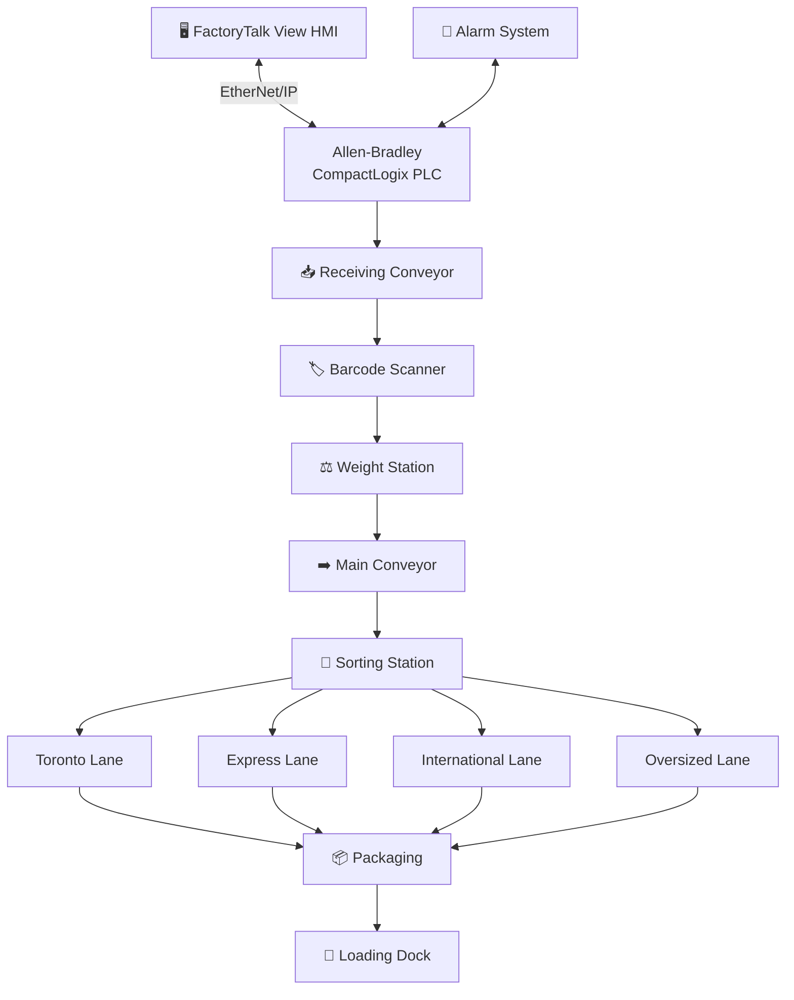
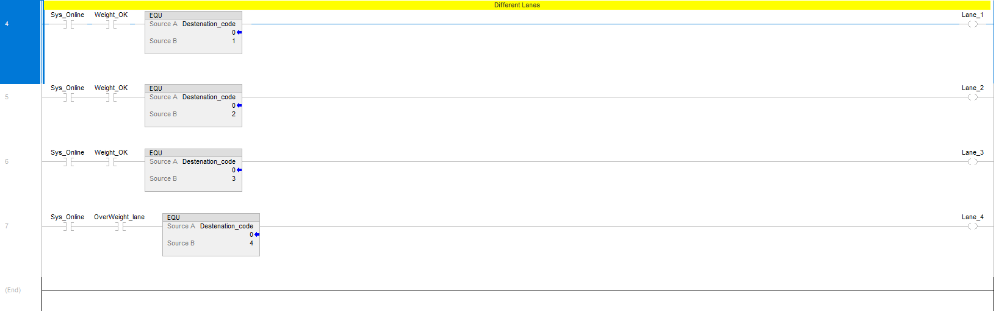
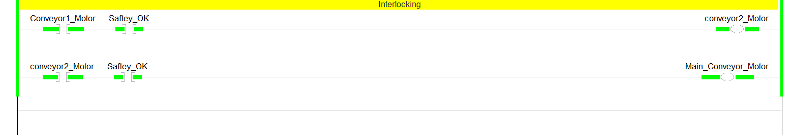
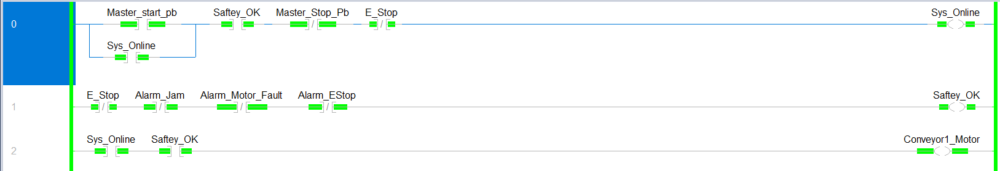

<!-- HERO IMAGE -->

  

<h1 align="center">Industrial Warehouse Package Sorting Automation System</h1>

  Allen-Bradley CompactLogix PLC control system that automates warehouse package handling from receiving through barcode identification, weight inspection, destination sorting, packaging, and shipment, with full FactoryTalk View HMI supervision.

  
  
  
  
  
  
  
  

---

## ▶️ Demo

Full system demo on the FactoryTalk View HMI: package flow from receiving through sorting to the loading dock.

---

## 📌 Project Overview

An industrial control system that automates the full warehouse package-handling process, moving product from receiving through inspection, sorting, packaging, and shipment under PLC-based sequential control.

Packages enter on a receiving conveyor, are identified by a barcode scanner, and are checked at a weight station before the main conveyor indexes them to a sorting station that diverts each one to its destination lane. Conveyor coordination and interlocking keep product moving without collisions, weight inspection rejects oversized or out-of-tolerance packages, and destination routing directs each package to the correct lane.

The system is supervised end-to-end from a FactoryTalk View HMI, with live status, destination lane screens, package counts, and an alarm summary giving the operator complete visibility and control of the line.

### 🎯 Control Objectives

- Automatically detect packages entering the line.
- Identify each package destination from its barcode.
- Inspect package weight and reject oversized or out-of-tolerance packages.
- Coordinate and interlock the conveyors to prevent collisions and jams.
- Route each package to its correct destination lane.
- Count packages per lane and in total for throughput tracking.
- Monitor faults and annunciate alarms on the HMI.
- Provide emergency-stop and manual-mode operation for safety and maintenance.
- Run continuously with no operator intervention under normal conditions.

---

## ⭐ Project Highlights

| Feature | Value |
|---------|-------|
| **Process** | Warehouse Package Sorting |
| **PLC** | Allen-Bradley CompactLogix |
| **HMI** | FactoryTalk View |
| **Communication** | EtherNet/IP |
| **Control Type** | Sequential Material Handling |
| **Destination Lanes** | Toronto, Express, International, Oversized |
| **Testing** | Commissioned and Tested on Allen-Bradley Hardware |

---

## ✨ Features

- ✔ Automatic Package Detection
- ✔ Barcode Identification
- ✔ Weight Inspection
- ✔ Oversized Package Rejection
- ✔ Destination Sorting (Four Lanes)
- ✔ Conveyor Interlocking
- ✔ Package Counting
- ✔ Alarm Handling
- ✔ Emergency Stop
- ✔ Manual Mode
- ✔ FactoryTalk View HMI Supervision

---

## 🏗️ System Architecture

Packages flow from receiving through identification and inspection to a sorting station that diverts each one to its destination lane, then to packaging and the loading dock. The HMI and alarm system communicate with the PLC over EtherNet/IP for supervision and annunciation.

---

## 🖼️ Project Gallery

| Main Overview HMI | Manual Control Screen | Alarm Screen |
|:---:|:---:|:---:|
|  |  |  |

---

## 📹 System Demonstrations

### Alarm Activation

Triggers a fault condition and shows the alarm latching, annunciating on the FactoryTalk View alarm summary, and clearing on operator acknowledgement.

---

### Destination Selection

Shows the destination routing logic sending a package to the selected lane, energizing the correct divert and updating the lane screen and package count.

---

## ⚙️ PLC Logic

### Package Detection, Counting & Weight

Every rung is gated by `Sys_Online`, so counting and weight checks only run while the line is started. `Package_Entry_Sensor` drives a `CTU` (`Number_of_packages`) that increments as each package enters. `Weight_OK_Sensor` sets `Weight_OK` to pass an in-spec package, and `Weight_Overweight_Sensor` energizes `OverWeight_lane` to send an overweight package to the oversized lane.

---

### Destination Sorting

Each rung is gated by `Sys_Online`, and the standard lanes also require `Weight_OK`. An `EQU` compares `Destenation_code` against 1, 2, or 3 and energizes the matching lane, `Lane_1` through `Lane_3`. `Lane_4` is gated by `OverWeight_lane` with code 4, routing overweight packages to the oversized lane.

---

### Conveyor Interlocking

Each conveyor is interlocked behind the one before it. `Conveyor1_Motor` and `Saftey_OK` energize `conveyor2_Motor`, and `conveyor2_Motor` with `Saftey_OK` energizes `Main_Conveyor_Motor`. Because `Saftey_OK` is in every rung, losing it stops all of the conveyors.

---

### Alarm Handling

`Conv_Jam_Sensor` starts `Jam_onTimer` (10 s), and `Alarm_Jam` latches only if the sensor is still blocked when the timer finishes. `E_Stop` latches `Alarm_EStop`, and a running `Conveyor1_Motor` with no `Motor1_feedback` latches `Alarm_Motor_Fault`. Each alarm is latched (`OTL`) and cleared by `Reset_Jam`, `Reset_E_Stop`, or `Reset_Motor_Alarm` (`OTU`).

---

### System Start (System Online)

`Master_start_pb` sets `Sys_Online`, which seals in through its own contact and holds while `Saftey_OK` is on and `Master_Stop_Pb` and `E_Stop` are clear. `Saftey_OK` is set only when `E_Stop`, `Alarm_Jam`, `Alarm_Motor_Fault`, and `Alarm_EStop` are all clear. With `Sys_Online` and `Saftey_OK` both on, `Conveyor1_Motor` starts.

---

## 🧠 Engineering Challenges

- **<ins>Preventing package collisions</ins>**: sequencing detection, indexing, and diverts so two packages never meet at a merge or divert point.
- **<ins>Coordinating multiple conveyors</ins>**: interlocking receiving, main, and lane conveyors so product only moves when the next stage is ready.
- **<ins>Ensuring destination accuracy</ins>**: tracking each package from barcode read to divert so it reaches the correct lane every time.
- **<ins>Handling oversized packages</ins>**: catching out-of-tolerance weight and routing rejects cleanly without stalling the line.
- **<ins>Maintaining continuous throughput</ins>**: keeping the line indexing steadily under normal conditions with no operator intervention.
- **<ins>Designing scalable ladder logic</ins>**: structuring the routing and interlocks so lanes can be added or reassigned in software.
- **<ins>Preventing false alarms</ins>**: qualifying fault conditions so transient sensor states do not nuisance-trip the alarm summary.

---

## ✅ Testing & Validation

| Function | Status |
|----------|:------:|
| Package Detection | ✅ Verified |
| Barcode Reading | ✅ Verified |
| Weight Inspection | ✅ Verified |
| Destination Routing | ✅ Verified |
| Oversized Detection | ✅ Verified |
| Package Counter | ✅ Verified |
| Alarm Handling | ✅ Verified |
| Emergency Stop | ✅ Verified |
| HMI Communication | ✅ Verified |
| PLC Communication | ✅ Verified |

---

## 📈 Results

- ✔ Developed a complete PLC control system for an automated warehouse package-sorting line
- ✔ Simulated four independent destination lanes with barcode-based routing
- ✔ Implemented seven FactoryTalk View HMI screens for operator supervision
- ✔ Integrated nine digital inputs and eight digital outputs
- ✔ Built conveyor interlocking and a sealed-in System Online start with safety aggregation
- ✔ Validated package detection, counting, weight rejection, alarm response, and emergency-stop logic
- ✔ Verified PLC logic, HMI communication, and complete process operation in the Studio 5000 and FactoryTalk View development environment

---

## 🛠️ Technical Skills Demonstrated

---

## 👤 About the Author

**Anil Pantula**, Electrical Engineering Student, University of Windsor
Automation Technician Co-op @ Asamaka Industries Ltd.

Pursuing roles in Industrial Automation · Controls Engineering · PLC Programming · Robotics · Mechatronics

<!-- Add LinkedIn / email links here -->

Engineering portfolio project. Not an open-source software library.

